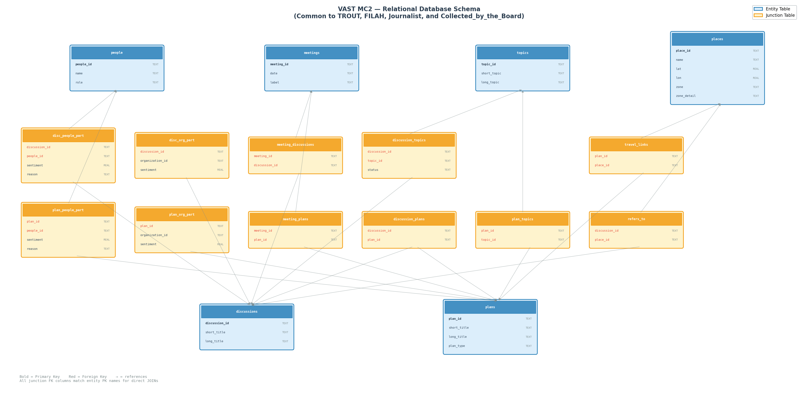

# g0r72a_Data_Peiyang_2526

## Background

Antwerp has enjoyed a relatively simple, fishing-based economy for decades. However, in recent times, tourism has greatly expanded and resulted in significant changes. The local government set up an oversight board - Commission on Overseeing the Economic Future of Oceanus (COOTEFOO) - to monitor the current economy and advise how to prepare for the future.

## Accusations

**Fishing is Living and Heritage (FILAH)** accuses the board of being biased toward the new tourism economy and inappropriately attending to the potential in those ventures, ignoring the historical powerhouse of the economy: Getting lots of fish out of the water and off to hungry people. They accuse some COOTEFOO members of bias against fishing.

**Tourism Raises OceanUs Together (TROUT)** accuses the board of being biased toward an entrenched interest and constantly "appeasing" the fishing industry, ignoring the new/growing avenues for economic stability. They accuse some members of ignoring the brave-new-world and living in the past.

## Data

### Source:
- Collected by the Board
- Collected by the Journalist

### Schema Diagram

## Personas

### Elena Petrova (pro-fishing)

Elena Petrova is a representative of Fishing is Living and Heritage (FILAH). She is concerned that the recent enthusiasm for tourism is causing the board to undervalue the fishing sector, despite its long-standing economic and cultural importance to Saltmere. She wants to understand whether committee decisions, and investments systematically disadvantage fishing interests. She is looking for clear visual evidence that shows whether fishing is being neglected, misrepresented, or treated unfairly compared with tourism.

### Lucas Moreau (pro-tourism)

Lucas Moreau works with Tourism Raises OceanUs Together (TROUT). He believes Saltmere's future depends on embracing tourism as a growing source of jobs, income, and resilience, and he worries that the board remains too attached to the traditional fishing economy. He wants to see whether committee behaviour and strategic attention are disproportionately favouring fishing over emerging opportunities in tourism. He needs visual summaries that reveal whether the board is holding back change and failing to respond to the town's evolving economic reality.

### Marta Kowalska (journalist)

Marta Kowalska is an investigative journalist covering the accusations made by both FILAH and TROUT. She is not committed to either side and wants to build an evidence-based account of whether bias is present, exaggerated, or unsupported. She needs to compare claims from the different groups against the broader data collected by both the government and independent reporting. She wants visualisations that help her identify patterns, inconsistencies, and possible conflicts of interest, so that she can communicate a balanced and credible story to the public.
